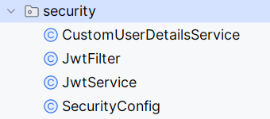

# Autenticación y autorización con JWT (Json Web Token) en un proyecto Spring Boot

1. **Dependencias necesarias**.
2. **Creación de un controlador de autenticación** para gestionar la autenticación de usuarios.
3. **Middleware o filtros para autorizar el acceso a los endpoints** según si un usuario está autenticado y autorizado.
4. **Configuración de seguridad** para que los endpoints sean accesibles según las reglas publicadas.

---

## Añadir dependencias al proyecto

Añadimos Spring Security como starter.

Es necesario añadir manualmente la dependencia a **Java JWT**.

```
        <dependency>
            <groupId>io.jsonwebtoken</groupId>
            <artifactId>jjwt-api</artifactId>
            <version>0.12.6</version>
        </dependency>
        <dependency>
            <groupId>io.jsonwebtoken</groupId>
            <artifactId>jjwt-impl</artifactId>
            <version>0.12.6</version>
            <scope>compile</scope>
        </dependency>
        <dependency>
            <groupId>io.jsonwebtoken</groupId>
            <artifactId>jjwt-jackson</artifactId>
            <version>0.12.6</version>
            <scope>compile</scope>
        </dependency>
```
---

## Crear Entidades de Usuario y Rol

**Entidad Role:**

```
@Entity
@Table(name = "roles")
@Getter
@AllArgsConstructor
public class Rol {
    @Id
    @GeneratedValue(strategy = GenerationType.IDENTITY)
    private Long id;

    @Column(unique = true, nullable = false)
    private String name;

    @ManyToMany(mappedBy = "roles")
    private Set<Usuario> users;

    public Rol() {
        users = new HashSet<Usuario>();
    }

    public Rol(Long id, String name) {
        this();
        this.id = id;
        this.name = name;

    }

    @Override
    public String toString() {
        return "Rol{" +
                "id=" + id +
                ", name='" + name + '\'' +
                '}';
    }

}


```

**Entidad User:**

En Spring Security, cuando haces login con usuario y contraseña, el framework necesita saber:
- Quién eres → el “username”.
- Qué permisos tienes → los “roles” o “authorities”.

Para ello, Spring Security define una interfaz llamada UserDetails, que describe cómo debe lucir un “usuario autenticable”.

La implementamos directamente en la entidad Usuario, de modo que Spring pueda usar los datos del usuario de la BD.

1. Spring llama a tu implementación de UserDetailsService.loadUserByUsername().
2. Este servicio busca al Usuario en la BD.
3. Spring crea un UserDetails (tu Usuario).
4. Compara la contraseña cifrada con la introducida.
5. Si todo es correcto, crea un Authentication en el contexto con los roles de getAuthorities().

```
@Entity
@Table(name = "users")
@Getter
@Setter
public class Usuario implements UserDetails {
    @Id
    @GeneratedValue(strategy = GenerationType.IDENTITY)
    private Long id;

    @Column(unique = true, nullable = false)
    private String username;

    @Column(nullable = false)
    private String password;

    // fetch = FetchType.EAGER indica que los roles se cargan siempre junto con el usuario, lo cual es necesario porque Spring Security los necesita inmediatamente para construir las autoridades.
    @ManyToMany(fetch = FetchType.EAGER)
    @JoinTable(
            name = "users_roles",
            joinColumns = @JoinColumn(name = "user_id"),
            inverseJoinColumns = @JoinColumn(name = "role_id")
    )
    private Set<Rol> roles;

    public Usuario(){
        roles = new HashSet<>();
    }

    public void addRole(Rol rol) {
        roles.add(rol);
        //rol.getUsers().add(this);
    }

    public void removeRole(Rol rol) {
        roles.remove(rol);
        //rol.getUsers().remove(this);
    }


    // --------------------- 5 MÉTODOS DE LA INTERFACE UserDetails -----------------

    // Devuelve los roles convertidos en objetos GrantedAuthority
    @Override
    public Collection<? extends GrantedAuthority> getAuthorities() {
        return roles.stream()
                // si en bd el rol no tiene el prefijo ROLE_
                //.map (rol -> (GrantedAuthority) () -> "ROLE_"+rol.getName())
                .map(rol -> (GrantedAuthority) rol::getName)
                .collect(Collectors.toSet());
    }

    /**
     * Indica si la cuenta del usuario ha expirado.
     * Devuelve true si la cuenta no ha expirado.
     */
    @Override
    public boolean isAccountNonExpired() {
        return true;
        // // Devuelve true si la fecha actual es anterior o igual a la de expiración
        //    return !LocalDate.now().isAfter(accountExpirationDate);
    }

    /**
     * Indica si la cuenta del usuario está bloqueada.
     * Devuelve true si la cuenta no está bloqueada.
     */
    @Override
    public boolean isAccountNonLocked() { return true; }

    /**
     * Indica si las credenciales del usuario (contraseña) han expirado.
     * Devuelve true si las credenciales no han expirado.
     */
    @Override
    public boolean isCredentialsNonExpired() { return true; }

    /**
     * Indica si la cuenta del usuario está habilitada.
     * Devuelve true si la cuenta está activa.
     */
    @Override
    public boolean isEnabled() { return true; }

}
```

Spring Security trabaja con un sistema de autenticación basado en **UserDetailsService**, que carga los usuarios desde la base de datos. 

Al **implementar UserDetails**, tu entidad User es compatible con Spring Security y puedes personalizar la lógica de autenticación y autorización.

---

## Cargar datos por defecto

```
-- Crear roles por defecto
INSERT INTO roles (name) VALUES ('ROLE_USER');
INSERT INTO roles (name) VALUES ('ROLE_ADMIN');

-- No vamos a crear usuarios. Se crearán a través de un endpoint

```

---
## Crear Repositorios

Repositorio de usuarios:

```
public interface UserRepository extends JpaRepository<User, Long> {
    Optional<User> findByUsername(String username);
}

public interface RoleRepository extends JpaRepository<Role, Long> {
    Optional<Role> findByName(String name);
}

```

---

## Paquete security en nuestro proyecto



### 1. Servicio UserDetailsService

```
/**
 * Spring Security trabaja con un sistema de autenticación basado en UserDetailsService, que carga los usuarios desde la base de datos.
 * User, al implementar UserDetails, tu entidad User es compatible con Spring Security y puedes personalizar la lógica de autenticación y autorización.
 */
@Service
public class CustomUserDetailsService implements UserDetailsService {

    private final UsuarioRepository userRepository;

    @Autowired
    public CustomUserDetailsService(UsuarioRepository userRepository) {
        this.userRepository = userRepository;
    }

    @Override
    public UserDetails loadUserByUsername(String username) throws UsernameNotFoundException {

        // Cargar el usuario desde de la base de datos
        Usuario user = userRepository.findByUsername(username)
                .orElseThrow(() -> new UsernameNotFoundException(username));

        return user;

    }
}
```

### 2. Clase para manejar JWT

Crea un servicio para generar y validar tokens JWT.

**JwtService:**

- Generar tokens JWT con clave secreta.
- Extraer información del token.
- Valida si el token pertenece al usuario y si está expirado.

```
@Service
@RequiredArgsConstructor
public class JwtService {

    // LO QUE HACEMOS NOSOTROS = En lugar de usar una clave fija en application.properties, genera una nueva clave de forma dinámica.
    // Si usas SECRET_KEY generado dinámicamente en cada arranque, no podrás validar tokens emitidos en otra ejecución.
    private final SecretKey SECRET_KEY = generateSecureKey();

    // Si lo cargo desde application.properties ... problemas de seguridad en producción
//    @Value("${jwt.secret}")
//    private String secret;

    @Value("${jwt.expiration}")
    private String expiration;


    /**
     * Genera una clave nueva, aleatoria y segura en tiempo de ejecución.
     * Ideal para pruebas o ejemplos donde NO necesitas persistencia del token entre reinicios del servidor.
     * Cada vez que reinicias la app, se genera una nueva clave.
     * Esto hace que los tokens emitidos antes del reinicio ya no sean válidos, porque la firma ya no coincide.
     * @return
     */
    private SecretKey generateSecureKey() {
        return Jwts.SIG.HS256.key().build(); // Genera una clave segura aleatoria de 256 bits
    }

    /**
     * Devuelve la clave secreta usada para firmar y validar tokens.
     * @return
     */
    private SecretKey getSigningKey() {
        return SECRET_KEY;
    }

    /**
     * Genera un JWT para el usuario autenticado.
     * - Incluye los roles del usuario en la sección claims.
     * - Expira después de 1 hora (1000 * 60 * 60 ms).
     * - Firma el token con la clave secreta SECRET_KEY usando el algoritmo HS256.
     * @param userDetails
     * @return
     */
    public String generateToken(UserDetails userDetails) {
        Map<String, Object> claims = new HashMap<>();

        Set<String> roles = userDetails.getAuthorities().stream()
                .map(GrantedAuthority::getAuthority)
                .collect(Collectors.toSet()); // Cambiamos a Set para evitar duplicados

        claims.put("roles", roles);

        return Jwts.builder()
                .claims(claims)
                .subject(userDetails.getUsername())
                .issuedAt(new Date(System.currentTimeMillis()))
                //.expiration(new Date(System.currentTimeMillis() + 1000 * 60 * 60)) // 1 hora
                .expiration(new Date(System.currentTimeMillis() + 1000 * 60 * 60 * Integer.parseInt(expiration)))
                .signWith(getSigningKey(), Jwts.SIG.HS256)
                .compact();
    }

    public String extractUsername(String token) {
        return extractClaim(token, Claims::getSubject);
    }

    /*
        Un claim son piezas de información sobre un usuario que se encuentran empaquetadas y firmadas con un token de seguridad
        Método genérico para extraer datos del token:
            - extractClaim() permite extraer cualquier dato del token, como:
            - getSubject() → username
            - getExpiration() → fecha de expiración
            - get("roles") → roles del usuario
     */
    public <T> T extractClaim(String token, Function<Claims, T> claimsResolver) {
        final Claims claims = extractAllClaims(token);
        return claimsResolver.apply(claims);
    }

    /**
     * Verifica si el token es válido comparando:
     *
     * Si el username en el token es el mismo que en UserDetails.
     * Si el token no ha expirado.
     * @param token
     * @param userDetails
     * @return
     */
    public boolean isTokenValid(String token, UserDetails userDetails) {
        // Defensa extra
        final String username = extractUsername(token);
        return (username.equals(userDetails.getUsername())) && !isTokenExpired(token);
        //return !isTokenExpired(token);
    }

    /**
     *  Extrae la fecha de expiración del token y la compara con la fecha actual.
     *  Si la fecha de expiración ya pasó, el token es inválido.
     * @param token
     * @return
     */
    private boolean isTokenExpired(String token) {
        return extractClaim(token, Claims::getExpiration).before(new Date());
    }

    /**
     * Verifica y decodifica el token JWT.
     * Extrae todos los datos (claims), incluyendo:
     *
     * sub → nombre de usuario
     * roles → lista de roles
     * iat → fecha de emisión
     * exp → fecha de expiración
     * @param token
     * @return
     */
    private Claims extractAllClaims(String token) {
        return Jwts.parser()
                .verifyWith(getSigningKey())
                .build()
                .parseSignedClaims(token)
                .getPayload();
    }


}

```

**Añade estas propiedades a application.properties:**

```
# SECRET KEY (para producción)
#jwt.secret = tu_clave_super_secreta_123456789012345678901234567890
# especificado en horas
jwt.expiration = 2
```
[Propiedades en producción](./UsoPropiedadesProduccion.md)

### 3. Configurar filtros para interceptar solicitudes

Spring Security usa filtros para interceptar solicitudes antes de que lleguen a los controladores. 

Crea un filtro para comprobar si hay un JWT incluido en los encabezados de las solicitudes.

**JwtFilter**

```
/**
 * Filtro para comprobar si hay un JWT incluido en los encabezados de las solicitudes.
 * En una aplicación web, cada petición HTTP pasa por una cadena de filtros (filter chain) antes de llegar al controlador que realmente atiende la solicitud.
 * Es como los Filter de Jakarta Servlet API.
 * (por ejemplo, el DispatcherServlet de Spring MVC)...
 * OncePerRequestFilter: evitar que tu filtro se ejecute más de una vez por la misma petición (por ejemplo, en redirecciones o filtros interno)
 */
@Component
@RequiredArgsConstructor
public class JwtFilter extends OncePerRequestFilter {

    private final JwtService jwtService;
    private final UserDetailsService userDetailsService;


    @Override
    protected void doFilterInternal(HttpServletRequest request,
                                    HttpServletResponse response,
                                    FilterChain filterChain) throws ServletException, IOException {

        final String authHeader = request.getHeader("Authorization");

        System.out.println("Authorization header: [" + authHeader+"]");

        // Si no hay token, la solicitud sigue su curso (para endpoint públicos)
        if (authHeader == null || !authHeader.startsWith("Bearer ")) {
            filterChain.doFilter(request, response);
            return;
        }

        final String token = authHeader.substring(7); //Bearer (ocupa 7)
        System.out.println("token: " + token);

        // Vamos a analizar el token
        final String username = jwtService.extractUsername(token);

        System.out.println("Username: " + username);

        // Verifica que no haya ya una autenticación previa a la solicitud
        // Si ya está autenticado, no hace falta volver a autenticar
        // Comprobamos que todavía no hay un usuario autenticado en el contexto actual.
        if (username != null && SecurityContextHolder.getContext().getAuthentication() == null) {

            // Cargamos el usuario de la base de datos
            UserDetails userDetails = userDetailsService.loadUserByUsername(username);

            if(jwtService.isTokenValid(token,userDetails)){

                // Crear el objeto con el usuario autenticado y su roles
                // Segundo parámetro es null porque no necesitamos almacenar las credenciales (la contraseña) porque el token es la prueba de autenticación
                UsernamePasswordAuthenticationToken authentication = new UsernamePasswordAuthenticationToken(userDetails,null,userDetails.getAuthorities());

                // Asociar detalles de la solicitud (información adicional del contexto de la socitud http, como ip, nombre del host...)
                authentication.setDetails(new WebAuthenticationDetailsSource().buildDetails(request));

                // Registramos al usuario como autenticado
                // Crea una autenticación nueva y la registra en el contexto de seguridad
                // SecurityContextHolder es un contenedor que guarda quién está autenticado en el hilo actual de ejecución.
                SecurityContextHolder.getContext().setAuthentication(authentication);

            }

        }

        filterChain.doFilter(request, response);

    }
}

```


### 4. Configurar seguridad en la aplicación

Añade una clase de configuración para personalizar los permisos de acceso a los endpoints y registrar el filtro.

**SecurityConfig**

```
@Configuration
@EnableMethodSecurity // Habilita @PreAuthorize y @PostAuthorize
@RequiredArgsConstructor
//@EnableWebSecurity // No es necesario con Spring Boot 3.x / Spring Security 6.x
public class SecurityConfig {

    private final JwtFilter jwtAuthFilter;
    private final CustomUserDetailsService userDetailsService;

    @Bean
    public SecurityFilterChain securityFilterChain(HttpSecurity http) throws Exception {
        return http

                /*
                    Por defecto, los navegadores bloquean las peticiones entre dominios distintos.

                    CORS (Cross-Origin Resource Sharing) es un mecanismo del navegador que protege al usuario frente a peticiones no deseadas entre dominios distintos.

                    Si tu frontend y backend no están en el mismo origen, tienes que habilitar CORS. Por ejemplo:
                        - Tu frontend está en http://localhost:8080
                        - Tu backend (API REST) está en http://localhost:8081

                    Aunque sean ambos “localhost”, son distintos orígenes (porque el puerto cambia).
                    Por defecto, el navegador bloquea esas peticiones.

                    Si no defines los métodos (setAllowedMethods), headers (setAllowedHeaders) ni allowCredentials (setAllowCredentials), tu API:
                    - No aceptará peticiones del frontend.
                    - No permitirá que le envíen tokens en el header Authorization.

                    ¿Por qué OPTIONS?
                        Cuando haces una petición POST o DELETE con Authorization, el navegador envía una preflight request con método OPTIONS.
                        Si no permites OPTIONS, el navegador bloquea la petición real.
                        Si no permites OPTIONS, las peticiones con token JWT nunca llegarán al backend.
                 */
                .cors(cors -> cors.configurationSource(request -> {
                    CorsConfiguration config = new CorsConfiguration();
                    config.setAllowedOrigins(List.of("http://localhost:8080")); // Cambia al origen de tu frontend
                    config.setAllowedMethods(List.of("GET", "POST", "PUT", "DELETE", "OPTIONS"));
                    config.setAllowedHeaders(List.of("Authorization", "Content-Type"));
                    config.setAllowCredentials(true); // Si usas cookies o tokens en headers
                    return config;
                }))

                /*
                CSRF (Cross-Site Request Forgery) es un tipo de ataque donde un sitio malicioso puede hacer que un navegador autenticado
                (por ejemplo, con una cookie activa) haga una petición no deseada a otro sitio en el que el usuario está logueado.
                Es un ataque clásico en aplicaciones web basadas en sesiones y cookies.
                Su objetivo es hacer que el navegador del usuario realice una acción sin su consentimiento aprovechando que ya tiene una sesión abierta.
                 */
                /*
                ¿Por qué NO necesitas CSRF en una API REST?
                    - No usas cookies para la autenticación, sino tokens JWT que van en el header (normalmente en Authorization: Bearer ...).
                    - No hay formularios web ni sesiones HTML (como en aplicaciones MVC tradicionales).
                    - En APIs REST las peticiones maliciosas no pueden inyectar headers personalizados como Authorization desde un navegador,
                      por lo que el riesgo de CSRF no aplica.
                 */
                .csrf(csrf -> csrf.disable())
                // Le dice a Spring Security cómo debe manejar las sesiones HTTP
                // En una API REST con JWT, no se usan sesiones.
                .sessionManagement(sess -> sess.sessionCreationPolicy(SessionCreationPolicy.STATELESS))
                .headers(headers -> headers.frameOptions(frame -> frame.disable())) // permitir iframes (para H2)
                // Esto actúa antes del controlador
                .authorizeHttpRequests(auth -> auth
                        .requestMatchers("/auth/**","/h2-console/**").permitAll() // pública para login/register
                        .requestMatchers(HttpMethod.GET,"/api/productos").permitAll()
                        .requestMatchers(HttpMethod.POST,"/api/productos").authenticated()
                        .requestMatchers(HttpMethod.PUT,"/api/productos").hasRole("ADMIN")
                        .anyRequest().authenticated()
                )
                .authenticationProvider(authenticationProvider())
                .addFilterBefore(jwtAuthFilter, UsernamePasswordAuthenticationFilter.class)
                .build();
    }

    @Bean
    public AuthenticationProvider authenticationProvider() {
        DaoAuthenticationProvider provider = new DaoAuthenticationProvider();
        provider.setUserDetailsService(userDetailsService);
        provider.setPasswordEncoder(passwordEncoder());
        return provider;
    }

    @Bean
    public PasswordEncoder passwordEncoder() {
        return new BCryptPasswordEncoder();
    }

    // Sin este bean, Spring no sabrá cómo inyectar AuthenticationManager en tus clases.
    // Lo usamos en AuthController
    // No lo necesitas si todo el proceso de autenticación lo maneja Spring automáticamente, como cuando usas formLogin()
    // En una API REST con JWT, donde tú haces la autenticación manualmente y devuelves un token (como tú estás haciendo), sí lo necesitas.
    @Bean
    public AuthenticationManager authenticationManager(AuthenticationConfiguration config) throws Exception {
        return config.getAuthenticationManager();
    }
}

```

En Spring Security puedes controlar el acceso a dos niveles:
- En la configuración global, defines qué rutas son públicas o protegidas.
- En los controladores, con anotaciones como @PreAuthorize, defines qué roles pueden ejecutar cada método.
```
@PreAuthorize("hasRole('ADMIN')")
@PreAuthorize("hasAnyRole('USER','ADMIN')")
@PreAuthorize("isAuthenticated()")
@PreAuthorize("permitAll()")

```

--- 

## Crear controlador para autenticación

**AuthController**

### POST /auth/register

Registrar nuevo usuario:

    - Recibe un usuario y contraseña.
    - Registra un nuevo usuario en la base de datos.
    - Devuelve un mensaje de éxito.

### POST /auth/login

Hacer login:

    - Recibe un usuario y contraseña.
    - Autentica al usuario.
    - Genera un JWT y lo devuelve en la respuesta.