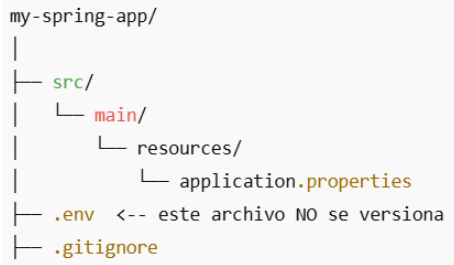

# Configurar propiedades

En proyectos Spring, usar **application.properties (o application.yml)** dentro del directorio src/main/resources es la forma estándar y recomendada para configurar propiedades del proyecto, pero no es adecuado para almacenar información sensible en entornos de producción, como:

- Credenciales de base de datos
- Claves API
- Tokens de acceso
- Secretos de servicios externos

Estos archivos se empaquetan dentro del jar o war final, y si alguien accede a ese archivo (o al repo si está versionado), puede ver directamente las propiedades. Así que no es seguro para secretos.

## FORMA 1: Variables de entorno (.env)

Puedes definir variables de entorno en el sistema o usar un archivo .env fuera del proyecto y cargarlo al entorno antes de ejecutar la app.

Spring Boot puede acceder a variables de entorno automáticamente: export DB_PASSWORD=secreto123

Y en application.properties usas: spring.datasource.password=${DB_PASSWORD}

### Ejemplo de un proyecto

**Estructura del proyecto:**



Asegúrate de ignorar el archivo .env para que no se suba al repo.

**Contenido de .env:**

```
DB_USERNAME=usuario_local
DB_PASSWORD=clave_secreta

```

**Contenido de application.properties:**

```
spring.datasource.url=jdbc:mysql://localhost:3306/mydb
spring.datasource.username=${DB_USERNAME}
spring.datasource.password=${DB_PASSWORD}
```

Spring Boot no carga automáticamente .env, pero puedes usar un plugin como dotenv-spring-boot.

## FORMA 2: application.properties con placeholders y configuración externa

Puedes empaquetar tu app sin valores sensibles y tener una copia externa del archivo con los valores reales. Por ejemplo:

```
# En resources/application.properties
spring.datasource.url=jdbc:mysql://localhost:3306/mydb
spring.datasource.username=${DB_USERNAME}
spring.datasource.password=${DB_PASSWORD}
```

Y pasar los valores con argumentos:

```
java -jar app.jar --DB_USERNAME=admin --DB_PASSWORD=secreto123
```

## FORMA 3: Usar servicios de configuración como Spring Cloud Config

Para entornos más complejos, puedes usar Spring Cloud Config para externalizar toda la configuración.
