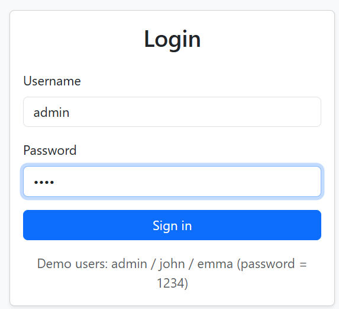
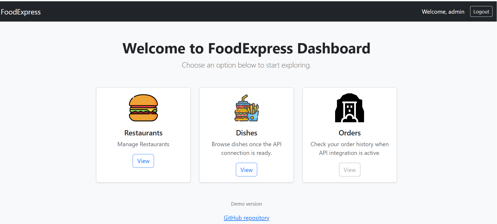
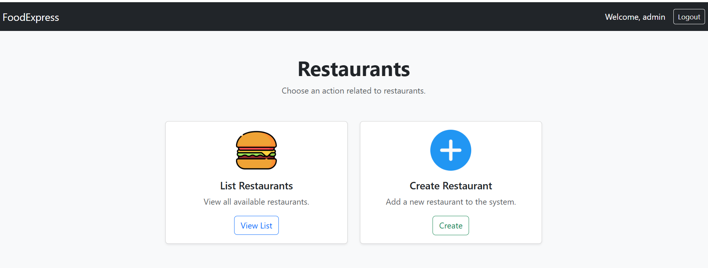
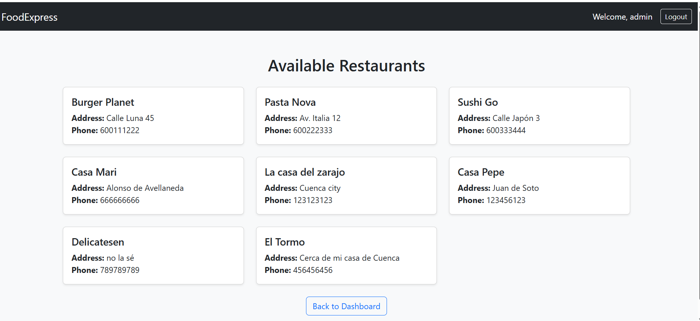
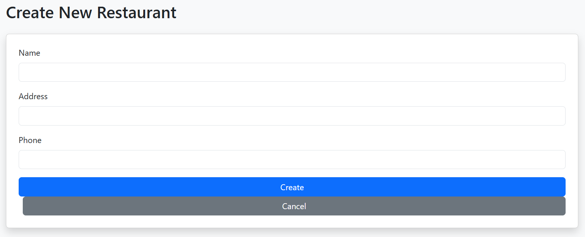

# FoodExpress 

Simula una plataforma de pedidos de comida a domicilio tipo Uber Eats /
Glovo.


Entorno completo con dos apps Spring:

- **FoodExpress API:** REST + JPA + JWT.
- **FoodExpress Web MVC:** aplicación Spring Boot MVC + Thymeleaf que consume la API.


# 1. FoodExpress API Rest
Trabajarás con:

- Spring Boot
- Spring Data JPA
- Spring Security + JWT
- H2 persistente en disco
- JPA avanzado
- Paginación
- ...

---

## 1.1. Proyecto con Gradle: solo con endpoint público GET /api/restaurants (finalmente haremos el proyecto completo con Maven)

**Gradle** es una herramienta de automatización de compilación de código abierto que simplifica tareas de desarrollo como compilar, probar y empaquetar software. 

Es muy utilizado en el ecosistema de Android y en proyectos Java, Groovy y Scala. 

Gradle mejora sistemas anteriores como Apache Ant y Maven al combinar la flexibilidad con una configuración más sencilla y eficiente, gracias a su lenguaje DSL basado en Groovy y la optimización de tareas.

**Groovy** es un lenguaje de programación de alto nivel, dinámico y orientado a objetos que funciona sobre la Máquina Virtual de Java (JVM). 

Se basa en los puntos fuertes de Java pero con una sintaxis más concisa y expresiva, similar a lenguajes como Python y Ruby, lo que lo hace muy productivo para el desarrollo. 

Se utiliza para scripting, automatización, desarrollo web y para extender aplicaciones Java. 

### Requisitos para usar Gradle

No es lo mismo el JDK para compilar el proyecto que el JDK que ejecuta Gradle!!!

✔ JDK 21 (si tu versión de Gradle es ≥ 8.6)

✔ JDK 17 (100% compatible con todas)


**En build.gradle:**

```
java {
    toolchain {
        languageVersion = JavaLanguageVersion.of(17)
    }
}
```

**Dependencia para Spring Security:**

```
// En el archivo build.gradle
dependencies {
    // ... otras dependencias
    implementation 'org.springframework.boot:spring-boot-starter-security'
}

```

**Dependiencias para JJWT:**

```
implementation 'io.jsonwebtoken:jjwt-api:0.12.6'
runtimeOnly 'io.jsonwebtoken:jjwt-impl:0.12.6'
runtimeOnly 'io.jsonwebtoken:jjwt-jackson:0.12.6'

```

**Dependencia para leer .env:**

```
implementation 'me.paulschwarz:spring-dotenv:4.0.0'
```


### CUIDADO CON GRADLE!!! 

Gradle ejecuta test automáticamente y al añadir la dependencia de Spring Security hay algo que no tenemos para que pasen esos test "No qualifying bean of type AuthenticationManager".

Por ahora dejamos el proyecto Gradle para avanzar en el resto de funcionalidades.


---

## 1.2. Proyecto con Maven


### Modelo de datos

| Entidad | Descripción |
|----------|--------------|
| **User** | Cliente, repartidor o administrador del sistema |
| **Role** | Define permisos (`ADMIN`, `CLIENTE`, `REPARTIDOR`) |
| **Restaurant** | Negocio registrado en la plataforma |
| **Dish** | Producto ofrecido por cada restaurante |
| **Order** | Solicitud de comida realizada por un usuario |
| **order_details** | Relación N:M entre pedido y platos (con cantidad y subtotal) |


| Tabla             | Descripción                                                    | Relaciones                                    |
| ----------------- | -------------------------------------------------------------- | --------------------------------------------- |
| `users`        | Usuarios autenticados del sistema                              | N:1 con `roles`                               |
| `roles`           | Roles de seguridad (ADMIN, CLIENTE, REPARTIDOR)                | 1:N con `users`                            |
| `restaurants`    | Datos de restaurantes registrados                              | 1:N con `dishes`, 1:N con `orders`           |
| `dishes`          | Platos ofrecidos por cada restaurante                          | N:1 con `restaurants`                        |
| `orders`         | Pedido realizado por un usuario (cliente)                      | N:1 con `users`, 1:N con `order_details` |
| `order_details` | Relación N:M entre `pedidos` y `platos` con cantidad, subtotal | N:1 con `orders`, N:1 con `dishes`           |


---

### Configuración de la BD H2 (persistente)

Basta con configurar la URL del datasource con jdbc:h2:file:
Spring Boot creará automáticamente el archivo de BD la primera vez que arranques la aplicación.

```
spring.datasource.url=jdbc:h2:file:./data/foodexpress-db;AUTO_SERVER=TRUE
spring.datasource.driverClassName=org.h2.Driver
spring.datasource.username=sa
spring.datasource.password=
spring.jpa.hibernate.ddl-auto=validate
spring.sql.init.mode=always
spring.jpa.show-sql=true

spring.h2.console.enabled=true
spring.h2.console.path=/h2-console

```

| Propiedad                            | Función                                                      |
| ------------------------------------ | ------------------------------------------------------------ |
| `jdbc:h2:file:./data/foodexpress-db` | Crea o usa BD física en `./data/` dentro del proyecto        |
| `AUTO_SERVER=TRUE`                   | Evita errores de “locked file” si accedes desde H2 Console   |
| `ddl-auto=validate`                  | Carga `schema.sql` y `data.sql` ; valida entidades contra BD |
| `spring.sql.init.mode=always`        | Ejecuta tu `data.sql` aunque haya BD física                  |
| `h2-console.enabled=true`            | Acceso por navegador para inspección                         |


**No se borra** entre ejecuciones.

**Carpeta data:** se crea automáticamente en la carpeta del proyecto, a nivel de la carpeta src.


---

Una vez que se ha creado la BD y cargado datos, desconfiguramos la ejecución de los script sql:

```
# spring.sql.init.mode=always
```

--- 

### Scripts SQL

- schema.sql
- data.sql

Los nombres por defecto que reconoce Spring son schema.sql y data.sql.
Esto evita tener que configurar unas propiedades para indicar otros nombres de scripts sql y además garantiza que primero se ejecute schema.sql (creando las tablas) y después data.sql (insertando datos de prueba).

**Actualización de los script SQL**

Poner a todos los usuarios la contreña "melola" encriptada.

```
-- password = melola (encriptada con bcrypt)
UPDATE users SET password = '$2a$10$IKp9rdPtsq4/L28Ivj85yOI0nyTRwKX1fHZfXDAKRePHQUD2vATGK';
```

---

### ENDPOINTS

### Endpoints trabajados en clase: Spring I

- POST /auth/login -> 200 OK (token)
- GET /api/restaurants → 200 OK (lista vacía o no)
- GET /api/restaurants/{id}
    - 200 OK si existe
    - 404 NOT FOUND si no existe
- POST /api/restaurants
    - 201 CREATED si se crea
    - 400 BAD REQUEST si algo falla en la creación (o lo lanza tu GlobalExceptionHandler)
- PUT /api/restaurants/{id}
    - 200 OK si se actualiza
    - 404 NOT FOUND si no existe
- DELETE /api/restaurants/{id}
    - 204 NO CONTENT si se borra
    - 404 NOT FOUND si no existe


### Endpoints Spring II

- GET /api/restaurants/{id}/dishes

Devolver todos los platos pertenecientes a un restaurante concreto.

- POST /api/restaurants/{id}/dishes

Crear un nuevo plato dentro de un restaurante concreto.

- GET /api/restaurants?name=Burger

Buscar restaurantes que contengan en el nombre Burguer

```
@GetMapping
public ResponseEntity<List<RestaurantDTO>> find(
        @RequestParam(required = false) String name) {

    List<RestaurantDTO> result =
            restaurantService.filter(name);

    return ResponseEntity.ok(result);
}
```

- GET /api/restaurants/{id}/dishes?category=Pasta


---

### Funciones de los diferentes perfiles

El modelo de la BD actual contempla las siguientes funcionalidades.

#### ¿Qué hace un usuario ADMIN?

- CRUD completo de restaurantes
- CRUD completo de platos
- Ver todos los pedidos
- Actualizar el estado de cualquier pedido

#### ¿Qué hace un usuario CLIENT?

- Crear pedidos
- Ver sus propios pedidos
- Cancelar pedidos en ciertos estados

#### ¿Qué puede hacer un repartidor (DELIVERY)?

La BD actual no tiene una tabla DELIVERY que se relacione con ORDERS (pedidos).

```
CLIENT → crea un pedido (estado: PENDIENTE)
RESTAURANTE/ADMIN → pasa a PREPARANDO
DELIVERY → pasa a RECOGIDO / EN_REPARTO
DELIVERY → pasa a ENTREGADO

```

- Un repartidor solo puede cambiar el estado de un pedido.
- No se puede asignar un pedido a un repartidor específico
- No se puede saber qué repartidor gestionó cada pedido
- No se pueden listar “mis entregas”

```
CLIENT → crea un pedido (estado: PENDIENTE)
RESTAURANTE/ADMIN → pasa a PREPARANDO
DELIVERY → pasa a RECOGIDO / EN_REPARTO
DELIVERY → pasa a ENTREGADO
```

- GET /api/orders?status=PREPARANDO
- PUT /api/orders/{id}/status
Body: { "status": "EN_REPARTO" }


---

### Autenticación (JWT)

| Método | Endpoint | Descripción |
|--------|-----------|-------------|
| `POST` | `/auth/login` | Inicia sesión y devuelve el token JWT |
| `POST` | `/auth/register` | Registra un nuevo usuario (rol CLIENTE por defecto) |
| `GET` | `/auth/profile` | Devuelve los datos del usuario autenticado |

| Método | Endpoint         | Descripción                                         | Cuerpo / Parámetros                          | Respuesta                                 |
| ------ | ---------------- | --------------------------------------------------- | -------------------------------------------- | ----------------------------------------- |
| `POST` | `/auth/login`    | Inicia sesión con credenciales y devuelve un JWT    | `{ "username": "juan", "password": "1234" }` | `200 OK` → `{ "token": "eyJhbGciOi..." }` |
| `POST` | `/auth/register` | Registra un nuevo usuario (rol CLIENTE por defecto) | `UsuarioRegistroDTO`                         | `201 CREATED` → `UsuarioDTO`              |
| `GET`  | `/auth/profile`  | Devuelve los datos del usuario autenticado          | Header: `Authorization: Bearer <token>`      | `200 OK` → `UsuarioDTO`                   |


---

### Usuarios y Roles (solo ADMIN)

| Método | Endpoint | Descripción |
|--------|-----------|-------------|
| `GET` | `/api/users` | Lista paginada de usuarios |
| `GET` | `/api/users/{id}` | Obtiene un usuario por ID |
| `POST` | `/api/users` | Crea un nuevo usuario con rol |
| `PUT` | `/api/users/{id}` | Actualiza usuario existente |
| `DELETE` | `/api/users/{id}` | Elimina un usuario |

| Método   | Endpoint             | Descripción                              | Cuerpo / Parámetros               | Respuesta                     |
| -------- | -------------------- | ---------------------------------------- | --------------------------------- | ----------------------------- |
| `GET`    | `/api/users`      | Lista paginada de usuarios               | `?page=0&size=10&sort=nombre,asc` | `200 OK` → `Page<UsuarioDTO>` |
| `GET`    | `/api/users/{id}` | Obtiene usuario por ID                   | `id`                              | `200 OK` → `UsuarioDTO`       |
| `POST`   | `/api/users`      | Crea un nuevo usuario con rol específico | `UsuarioCreateDTO`                | `201 CREATED` → `UsuarioDTO`  |
| `PUT`    | `/api/users/{id}` | Actualiza usuario existente              | `UsuarioUpdateDTO`                | `200 OK` → `UsuarioDTO`       |
| `DELETE` | `/api/users/{id}` | Elimina usuario                          | `id`                              | `204 NO CONTENT`              |


---

### Restaurantes

| Método | Endpoint                  | Descripción          | Respuesta    |
| ------ | ------------------------- | -------------------- | ------------ |
| GET    | `/api/restaurants`        | Lista paginada       | 200 OK       |
| GET    | `/api/restaurants/{id}`   | Detalle + platos     | 200 OK / 404 |
| GET    | `/api/restaurants?name=pizza` | Buscar por nombre    | 200 OK       |
| POST   | `/api/restaurants`        | Crear *(ADMIN)*      | 201 CREATED  |
| PUT    | `/api/restaurants/{id}`   | Actualizar *(ADMIN)* | 200 OK / 404 |
| DELETE | `/api/restaurants/{id}`   | Eliminar *(ADMIN)*   | 204 / 404    |


---

### Platos

| Método | Endpoint                       | Descripción                                    | Respuesta |
| ------ | ------------------------------ | ---------------------------------------------- | --------- |
| GET    | `/api/restaurants/{id}/dishes` | Lista platos del restaurante                   | 200 OK    |
| GET    | `/api/dishes/{dishId}`         | Detalle de plato                               | 200 / 404 |
| GET    | `/api/dishes`                  | Listado global opcional (paginación/categoría) | 200       |
| GET    | `/api/dishes?category=Pasta`   | Filtrar por categoría                          | 200       |
| POST   | `/api/restaurants/{id}/dishes` | Crear plato *(ADMIN)*                          | 201       |
| PUT    | `/api/dishes/{dishId}`         | Actualizar *(ADMIN)*                           | 200 / 404 |
| DELETE | `/api/dishes/{dishId}`         | Eliminar *(ADMIN)*                             | 204 / 404 |

---

### Pedidos

| Método | Endpoint                     | Descripción                         | Respuesta |
| ------ | ---------------------------- | ----------------------------------- | --------- |
| GET    | `/api/orders`                | Lista pedidos                       | 200       |
| GET    | `/api/orders/{id}`           | Detalle pedido                      | 200/404   |
| GET    | `/api/users/{userId}/orders` | Pedidos de usuario *(ADMIN)*        | 200       |
| POST   | `/api/orders`                | Crear pedido *(CLIENTE)*            | 201       |
| PUT    | `/api/orders/{id}/status`    | Cambiar estado *(ADMIN/REPARTIDOR)* | 200       |
| DELETE | `/api/orders/{id}`           | Cancelar pedido *(CLIENTE)*         | 204       |


---

### Reportes y Estadísticas (solo ADMIN)

| Endpoint | Descripción |
|-----------|-------------|
| `/api/reportes/ventas` | Ventas totales por restaurante |
| `/api/reportes/top-platos` | Platos más vendidos |
| `/api/reportes/clientes-frecuentes` | Clientes con más pedidos |
| `/api/reportes/ingresos-categoria` | Ingresos por categoría de plato |
| `/api/reportes/ticket-medio` | Promedio de gasto por restaurante |
| `/api/reportes/repartidores-top` | Repartidores con más entregas |

| Método | Endpoint                            | Descripción                     | Parámetros                           | Respuesta                                |
| ------ | ----------------------------------- | ------------------------------- | ------------------------------------ | ---------------------------------------- |
| `GET`  | `/api/reportes/ventas`              | Total de ventas por restaurante | `?desde=2025-10-01&hasta=2025-10-31` | `200 OK` → `List<VentaRestauranteDTO>`   |
| `GET`  | `/api/reportes/top-platos`          | Platos más vendidos (top N)     | `?limite=5`                          | `200 OK` → `List<PlatoVentaDTO>`         |
| `GET`  | `/api/reportes/clientes-frecuentes` | Clientes con más pedidos        | -                                    | `200 OK` → `List<ClienteEstadisticaDTO>` |


---

## Roles y accesos

| Rol | Permisos |
|------|-----------|
| `ADMIN` | CRUD completo + reportes |
| `CLIENTE` | Crear y consultar sus pedidos |
| `REPARTIDOR` | Ver y actualizar pedidos asignados |


--- 

## Info adicional en cuanto seguridad. Podríamos usar **OAuth2** y **Spring Authorization Server**.(no aplica)

Tu API ya no generaría JWT “a mano”.

Spring Authorization Server:
- genera tokens JWT firmados automáticamente
- valida tokens
- gestiona expiración
- gestiona cliente, scopes
- implementa flujos OAuth2

Y tu API se convierte en:
- Resource Server (valida tokens)

---

# 2. FoodExpress Web MVC


FoodExpress Web MVC es una aplicación Spring Boot MVC con Thymeleaf que actúa como interfaz web del API REST FoodExpress, permitiendo a los usuarios interactuar con el sistema de pedidos de comida a domicilio mediante páginas HTML dinámicas y seguras.

Se trata de una aplicación cliente del servicio REST (foodexpress-api), que se comunica con él a través de peticiones HTTP autenticadas con JWT.

El objetivo es reproducir un escenario real de integración entre una API backend y una aplicación web construida con Spring Boot MVC.

El proyecto está diseñado para aprender y practicar:

✅ Consumo de un API REST desde Spring Boot MVC usando WebClient.

✅ Autenticación con JWT (login vía API y almacenamiento de token en sesión).

✅ Gestión de vistas dinámicas con Thymeleaf (formularios, listados, detalle, fragmentos).

✅ Paginación y ordenación reales desde la API.

✅ Seguridad y roles con Spring Security en la capa web.

✅ Integración de plantillas HTML responsivas.

✅ Gestión de sesión y flujo de navegación seguro.

| Tecnología                     | Uso                                             |
| ------------------------------ | ----------------------------------------------- |
| **Spring Boot MVC**            | Framework para controladores web y vistas.      |
| **Thymeleaf**                  | Motor de plantillas HTML.                       |
| **Spring Security**            | Control de acceso a vistas, roles y sesión.     |
| **Spring WebFlux / WebClient** | Consumo de endpoints REST del API.              |
| **Bootstrap 5**                | Diseño y maquetación responsive.                |
| **H2 / API REST FoodExpress**  | Fuente de datos (la API expone la información). |
| **JWT (JSON Web Token)**       | Autenticación entre las dos aplicaciones.       |












---

## 1. Dependencias


---

## 2. Configuración base

```
server.port=8080
api.base-url=http://localhost:8081

spring.thymeleaf.cache=false

# H2 en memoria para usuarios/roles de la app MVC
spring.datasource.url=jdbc:h2:mem:mvc-users;DB_CLOSE_DELAY=-1;MODE=PostgreSQL
spring.datasource.driverClassName=org.h2.Driver
spring.datasource.username=sa
spring.jpa.hibernate.ddl-auto=create-drop
spring.h2.console.enabled=true

# Espera a que Hibernate cree las tablas, y solo después ejecuta los scripts SQL
spring.jpa.defer-datasource-initialization=true

```

**MODE=PostgreSQL**

Estás desarrollando o probando localmente con H2, pero tu base de datos real (en producción o en otro módulo) es PostgreSQL,y quieres asegurar compatibilidad SQL entre ambas.

**spring.thymeleaf.cache=false**

Desactiva la caché de plantillas Thymeleaf.
Por defecto, Spring Boot cachea las vistas para mejorar el rendimiento (especialmente en producción).

Cuando cache=true (valor por defecto):
- Cada vez que se renderiza una vista, Spring no vuelve a leer el archivo HTML, sino que usa una versión precompilada en memoria.
- Esto hace que si modificas el HTML mientras la aplicación está ejecutándose, los cambios no se ven hasta reiniciar el servidor.


Para entorno desarrollo ideal tenerlo a false. Se actualiza siempre y no hay que reiniciar.

---

## 3. Consigurar e implementar Seguridad y Autenticación

Sigue las instrucciones del profesor...


---

## 4. Vistas base

- / -> home
- home -> iniciar sesión -> login
- login -> dashboard
- dashboard -> Manage Restaurants
    - List restaurants
    - Create Restaurant(only admin)
- dashboard -> List all dishes
- dashboard -> Orders


Descarga las vistas para trabajar con ellas. Están en recursos.

Se irán añadiendo plantillas de Thymeleaf bajo demanda...


Vamos a trabajar con plantillas que usan la dependencia **Thymeleaf Extras Spring Security 6.**

```
        <dependency>
            <groupId>org.thymeleaf.extras</groupId>
            <artifactId>thymeleaf-extras-springsecurity6</artifactId>
        </dependency>
```

Esto permite usar en las plantillas expresiones como:

```
th:if="${#authorization.expression('hasRole(''ADMIN'')')}"
th:if="${#authorization.expression('hasAuthority(''ORDER_CREATE'')')}"
th:if="${#authentication.principal.enabled}"
th:if="${#authentication.isAuthenticated()}"

```

En vez de trabajar directamente con Authentication:

```
Authentication auth = SecurityContextHolder.getContext().getAuthentication();
model.addAttribute("isAdmin", auth.getAuthorities().stream()
        .anyMatch(a -> a.getAuthority().equals("ROLE_ADMIN")));
model.addAttribute("username", auth.getName());

```

---

## Funcionalidades vistas en clase

- Listar todos los restaurantes.
- Listar todos los platos (sin paginación).
- Crear restaurante.

**En el MVC:**

- Solo usuarios con ROLE_ADMIN pueden acceder a /restaurants/create/**.
- Eso lo controlas en SecurityConfig del MVC.

**En el API:**

- El endpoint POST /api/restaurants exige JWT con rol ADMIN del mundo API.
- El MVC llama al API con el usuario técnico api_admin (o admin) del mundo API.


--- 

## Todas las funcionalidades posibles 

Las iremos viendo en clase, las que de tiempo...


### Autenticación y seguridad

- Formulario de login (/login) autenticado contra BD H2.
- Uso de sesiones.
- Acceso a las vistas condicionado por el rol (ADMIN, CLIENTE, REPARTIDOR).
- Logout con limpieza de sesión.

### Catálogo de restaurantes y platos

- Listado paginado de restaurantes (/restaurantes).
- Listado y detalle de platos con filtros por categoría o restaurante.
- Vista de detalle de plato (/platos/{id}) con información completa.
- Posibilidad de añadir platos al carrito (almacenado en sesión).

### Gestión de pedidos

- Visualización del carrito actual y confirmación de pedido.
- Creación de pedidos a través de la API (POST /api/pedidos).
- Listado de pedidos del usuario autenticado (/mis-pedidos).
- Detalle de cada pedido (estado, fecha, importe, platos).
- Cancelación de pedidos si aún no fueron entregados.

### Zona administrativa (rol ADMIN)

Panel de administración /admin con opciones para:
- Gestionar restaurantes y platos (CRUD completo).
- Consultar pedidos y cambiar estado.
- Visualizar reportes y estadísticas (ventas, top platos, clientes frecuentes, etc.) obtenidos desde la API.

### Reportes y estadísticas 

- Visualización de métricas como:
    - Total de ventas por restaurante.
    - Platos más vendidos.
    - Ticket medio por restaurante.
    - Clientes más activos.
    - Los datos se obtienen mediante endpoints avanzados del API REST y se presentan en tablas o gráficos (por ejemplo, con Chart.js).

# 3. Continuará....

Spring II: https://github.com/profeMelola/ProyectoFoodExpress