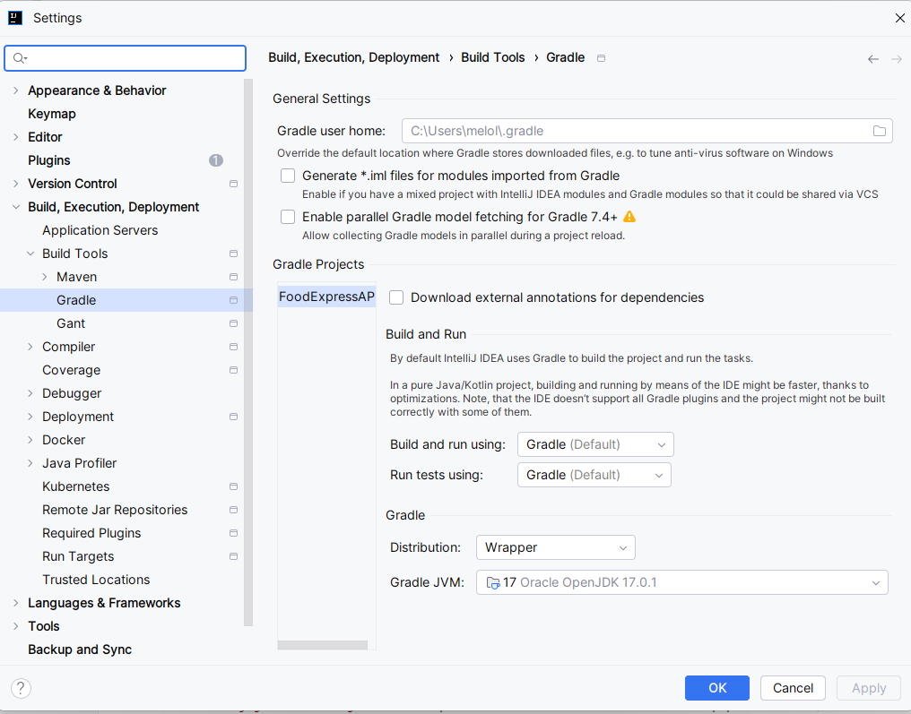
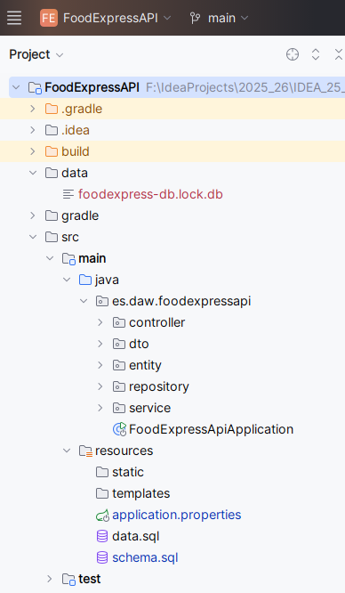
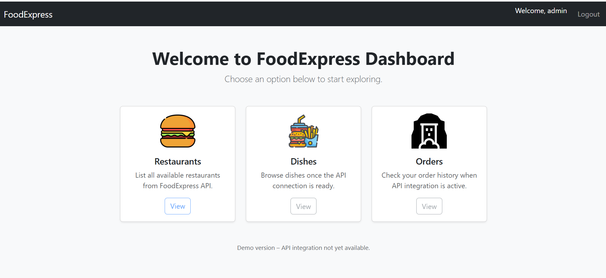
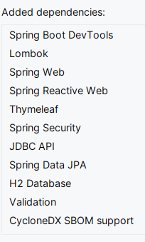
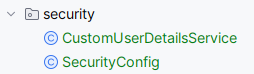

# FoodExpress 

Simula una plataforma de pedidos de comida a domicilio tipo Uber Eats /
Glovo.


Entorno completo con dos apps Spring:

- FoodExpress API (ya la tienes): REST + JPA + JWT.
- FoodExpress Web MVC: aplicación Spring Boot MVC + Thymeleaf que consume la API.


# 1. FoodExpress API Rest
Trabajarás con:

- Spring Boot
- Spring Data JPA
- Spring Security + JWT
- H2 persistente en disco
- JPA avanzado
- Paginación

---

## Proyecto Gradle

**Gradle** es una herramienta de automatización de compilación de código abierto que simplifica tareas de desarrollo como compilar, probar y empaquetar software. 

Es muy utilizado en el ecosistema de Android y en proyectos Java, Groovy y Scala. 

Gradle mejora sistemas anteriores como Apache Ant y Maven al combinar la flexibilidad con una configuración más sencilla y eficiente, gracias a su lenguaje DSL basado en Groovy y la optimización de tareas.

**Groovy** es un lenguaje de programación de alto nivel, dinámico y orientado a objetos que funciona sobre la Máquina Virtual de Java (JVM). 

Se basa en los puntos fuertes de Java pero con una sintaxis más concisa y expresiva, similar a lenguajes como Python y Ruby, lo que lo hace muy productivo para el desarrollo. 

Se utiliza para scripting, automatización, desarrollo web y para extender aplicaciones Java. 

### Requisitos para usar Gradle

No es lo mismo el JDK para compilar el proyecto que el JDK que ejecuta Gradle!!!



**En build.gradle:**

```
java {
    toolchain {
        languageVersion = JavaLanguageVersion.of(17)
    }
}
```


## Modelo de datos

| Entidad | Descripción |
|----------|--------------|
| **User** | Cliente, repartidor o administrador del sistema |
| **Role** | Define permisos (`ADMIN`, `CLIENTE`, `REPARTIDOR`) |
| **Restaurant** | Negocio registrado en la plataforma |
| **Dish** | Producto ofrecido por cada restaurante |
| **Order** | Solicitud de comida realizada por un usuario |
| **order_details** | Relación N:M entre pedido y platos (con cantidad y subtotal) |


| Tabla             | Descripción                                                    | Relaciones                                    |
| ----------------- | -------------------------------------------------------------- | --------------------------------------------- |
| `users`        | Usuarios autenticados del sistema                              | N:1 con `roles`                               |
| `roles`           | Roles de seguridad (ADMIN, CLIENTE, REPARTIDOR)                | 1:N con `users`                            |
| `restaurants`    | Datos de restaurantes registrados                              | 1:N con `dishes`, 1:N con `orders`           |
| `dishes`          | Platos ofrecidos por cada restaurante                          | N:1 con `restaurants`                        |
| `orders`         | Pedido realizado por un usuario (cliente)                      | N:1 con `users`, 1:N con `order_details` |
| `order_details` | Relación N:M entre `pedidos` y `platos` con cantidad, subtotal | N:1 con `orders`, N:1 con `dishes`           |


---

## Configuración de la BD H2 (persistente)

Basta con configurar la URL del datasource con jdbc:h2:file:
Spring Boot creará automáticamente el archivo de BD la primera vez que arranques la aplicación.

```
spring.datasource.url=jdbc:h2:file:./data/foodexpress-db;AUTO_SERVER=TRUE
spring.datasource.driverClassName=org.h2.Driver
spring.datasource.username=sa
spring.datasource.password=
spring.jpa.hibernate.ddl-auto=validate
spring.sql.init.mode=always
spring.jpa.show-sql=true

spring.h2.console.enabled=true
spring.h2.console.path=/h2-console

```

| Propiedad                            | Función                                                      |
| ------------------------------------ | ------------------------------------------------------------ |
| `jdbc:h2:file:./data/foodexpress-db` | Crea o usa BD física en `./data/` dentro del proyecto        |
| `AUTO_SERVER=TRUE`                   | Evita errores de “locked file” si accedes desde H2 Console   |
| `ddl-auto=validate`                  | Carga `schema.sql` y `data.sql` ; valida entidades contra BD |
| `spring.sql.init.mode=always`        | Ejecuta tu `data.sql` aunque haya BD física                  |
| `h2-console.enabled=true`            | Acceso por navegador para inspección                         |


**No se borra** entre ejecuciones.

**Carpeta data:** se crea automáticamente en la carpeta del proyecto, a nivel de la carpeta src.



---

Una vez que se ha creado la BD y cargado datos, desconfiguramos la ejecución de los script sql:

```
# spring.sql.init.mode=always
```

## Si usamos Gradle para montar el API

**Dependencia para Spring Security:**

```
// En el archivo build.gradle
dependencies {
    // ... otras dependencias
    implementation 'org.springframework.boot:spring-boot-starter-security'
}

```

**Dependiencias para JJWT:**

```
implementation 'io.jsonwebtoken:jjwt-api:0.11.5'
runtimeOnly 'io.jsonwebtoken:jjwt-impl:0.11.5'
runtimeOnly 'io.jsonwebtoken:jjwt-jackson:0.11.5'

```

Podríamos usar **OAuth2** y **Spring Authorization Server**.

Tu API ya no generaría JWT “a mano”.

Spring Authorization Server:
- genera tokens JWT firmados automáticamente
- valida tokens
- gestiona expiración
- gestiona cliente, scopes
- implementa flujos OAuth2

Y tu API se convierte en:
- Resource Server (valida tokens)
---

## Endpoints principales


### Autenticación (JWT)

| Método | Endpoint | Descripción |
|--------|-----------|-------------|
| `POST` | `/auth/login` | Inicia sesión y devuelve el token JWT |
| `POST` | `/auth/register` | Registra un nuevo usuario (rol CLIENTE por defecto) |
| `GET` | `/auth/profile` | Devuelve los datos del usuario autenticado |

| Método | Endpoint         | Descripción                                         | Cuerpo / Parámetros                          | Respuesta                                 |
| ------ | ---------------- | --------------------------------------------------- | -------------------------------------------- | ----------------------------------------- |
| `POST` | `/auth/login`    | Inicia sesión con credenciales y devuelve un JWT    | `{ "username": "juan", "password": "1234" }` | `200 OK` → `{ "token": "eyJhbGciOi..." }` |
| `POST` | `/auth/register` | Registra un nuevo usuario (rol CLIENTE por defecto) | `UsuarioRegistroDTO`                         | `201 CREATED` → `UsuarioDTO`              |
| `GET`  | `/auth/profile`  | Devuelve los datos del usuario autenticado          | Header: `Authorization: Bearer <token>`      | `200 OK` → `UsuarioDTO`                   |


---

### Usuarios y Roles (solo ADMIN)

| Método | Endpoint | Descripción |
|--------|-----------|-------------|
| `GET` | `/api/users` | Lista paginada de usuarios |
| `GET` | `/api/users/{id}` | Obtiene un usuario por ID |
| `POST` | `/api/users` | Crea un nuevo usuario con rol |
| `PUT` | `/api/users/{id}` | Actualiza usuario existente |
| `DELETE` | `/api/users/{id}` | Elimina un usuario |

| Método   | Endpoint             | Descripción                              | Cuerpo / Parámetros               | Respuesta                     |
| -------- | -------------------- | ---------------------------------------- | --------------------------------- | ----------------------------- |
| `GET`    | `/api/users`      | Lista paginada de usuarios               | `?page=0&size=10&sort=nombre,asc` | `200 OK` → `Page<UsuarioDTO>` |
| `GET`    | `/api/users/{id}` | Obtiene usuario por ID                   | `id`                              | `200 OK` → `UsuarioDTO`       |
| `POST`   | `/api/users`      | Crea un nuevo usuario con rol específico | `UsuarioCreateDTO`                | `201 CREATED` → `UsuarioDTO`  |
| `PUT`    | `/api/users/{id}` | Actualiza usuario existente              | `UsuarioUpdateDTO`                | `200 OK` → `UsuarioDTO`       |
| `DELETE` | `/api/users/{id}` | Elimina usuario                          | `id`                              | `204 NO CONTENT`              |


---

### Restaurantes

| Método | Endpoint | Descripción |
|--------|-----------|-------------|
| `GET` | `/api/restaurants` | Lista paginada de restaurantes |
| `GET` | `/api/restaurants/{id}` | Detalle con platos incluidos |
| `POST` | `/api/restaurants` | Crear nuevo restaurante *(ADMIN)* |
| `PUT` | `/api/restaurants/{id}` | Actualizar restaurante *(ADMIN)* |
| `DELETE` | `/api/restaurants/{id}` | Eliminar restaurante *(ADMIN)* |
| `GET` | `/api/restaurants/find?nombre=...` | Buscar por nombre o zona |

| Método   | Endpoint                   | Descripción                               | Cuerpo / Parámetros               | Respuesta                                           |
| -------- | -------------------------- | ----------------------------------------- | --------------------------------- | --------------------------------------------------- |
| `GET`    | `/api/restaurants`        | Lista paginada de restaurantes            | `?page=0&size=10&sort=nombre,asc` | `200 OK` → `Page<RestaurantDTO>`                   |
| `GET`    | `/api/restaurants/{id}`   | Detalle de un restaurante                 | `id`                              | `200 OK` → `RestauranteDetalleDTO` (incluye platos) |
| `POST`   | `/api/restaurants`        | Crea un restaurante *(ADMIN)*             | `RestauranteCreateDTO`            | `201 CREATED` → `RestaurantDTO`                    |
| `PUT`    | `/api/restaurants/{id}`   | Actualiza datos del restaurante *(ADMIN)* | `RestauranteUpdateDTO`            | `200 OK` → `RestaurantDTO`                         |
| `DELETE` | `/api/restaurants/{id}`   | Elimina restaurante *(ADMIN)*             | `id`                              | `204 NO CONTENT`                                    |
| `GET`    | `/api/restaurants/find` | Filtro por nombre o zona                  | `?nombre=pizza`                   | `200 OK` → `List<RestaurantDTO>`                   |

---

### Platos

| Método | Endpoint | Descripción |
|--------|-----------|-------------|
| `GET` | `/api/dishes` | Lista paginada de platos |
| `GET` | `/api/dishes/{id}` | Obtiene un plato por ID |
| `GET` | `/api/dishes/category/{category}` | Filtra por categoría |
| `GET` | `/api/dishes/restaurante/{restaurantId}` | Platos de un restaurante |
| `POST` | `/api/dishes` | Crear plato *(ADMIN)* |
| `PUT` | `/api/dishes/{id}` | Actualizar plato *(ADMIN)* |
| `DELETE` | `/api/dishes/{id}` | Eliminar plato *(ADMIN)* |

| Método   | Endpoint                                  | Descripción                        | Cuerpo / Parámetros               | Respuesta                   |
| -------- | ----------------------------------------- | ---------------------------------- | --------------------------------- | --------------------------- |
| `GET`    | `/api/dishes`                             | Lista paginada de platos           | `?page=0&size=5&sort=precio,desc` | `200 OK` → `Page<DishDTO>` |
| `GET`    | `/api/dishes/{id}`                        | Detalle de un plato                | `id`                              | `200 OK` → `DishDTO`       |
| `GET`    | `/api/dishes/category/{category}`       | Filtra por categoría (ej. “Pasta”) | `categoria`                       | `200 OK` → `List<DishDTO>` |
| `GET`    | `/api/dishes/restaurant/{restaurantId}` | Platos de un restaurante           | `restauranteId`                   | `200 OK` → `List<DishDTO>` |
| `POST`   | `/api/dishes`                             | Crea un nuevo plato *(ADMIN)*      | `PlatoCreateDTO`                  | `201 CREATED` → `DishDTO`  |
| `PUT`    | `/api/dishes/{id}`                        | Actualiza un plato *(ADMIN)*       | `PlatoUpdateDTO`                  | `200 OK` → `DishDTO`       |
| `DELETE` | `/api/dishes/{id}`                        | Elimina un plato *(ADMIN)*         | `id`                              | `204 NO CONTENT`            |


---

### Pedidos

| Método | Endpoint | Descripción |
|--------|-----------|-------------|
| `GET` | `/api/orders` | Lista de pedidos (propios o todos según rol) |
| `GET` | `/api/orders/{id}` | Detalle completo del pedido |
| `POST` | `/api/orders` | Crear nuevo pedido *(CLIENTE)* |
| `PUT` | `/api/orders/{id}/estado` | Cambiar estado *(REPARTIDOR/ADMIN)* |
| `DELETE` | `/api/orders/{id}` | Cancelar pedido *(CLIENTE)* |
| `GET` | `/api/orders/usuario/{usuarioId}` | Pedidos por usuario *(ADMIN)* |
| `GET` | `/api/orders/fecha?desde=...&hasta=...` | Filtrar por rango de fechas |

| Método   | Endpoint                           | Descripción                                            | Cuerpo / Parámetros                            | Respuesta                     |
| -------- | ---------------------------------- | ------------------------------------------------------ | ---------------------------------------------- | ----------------------------- |
| `GET`    | `/api/orders`                     | Lista de pedidos (ADMIN: todos, CLIENTE: solo propios) | `?page=0&size=5`                               | `200 OK` → `Page<PedidoDTO>`  |
| `GET`    | `/api/orders/{id}`                | Detalle del pedido (con platos y totales)              | `id`                                           | `200 OK` → `PedidoDetalleDTO` |
| `POST`   | `/api/orders`                     | Crea nuevo pedido *(CLIENTE)*                          | `PedidoCreateDTO` con `List<DetallePedidoDTO>` | `201 CREATED` → `PedidoDTO`   |
| `PUT`    | `/api/orders/{id}/estado`         | Actualiza estado *(ADMIN o REPARTIDOR)*                | `{"estado": "ENTREGADO"}`                      | `200 OK` → `PedidoDTO`        |
| `DELETE` | `/api/orders/{id}`                | Cancela pedido *(CLIENTE antes de confirmar)*          | `id`                                           | `204 NO CONTENT`              |
| `GET`    | `/api/orders/usuario/{usuarioId}` | Pedidos de un cliente específico *(ADMIN)*             | `usuarioId`                                    | `200 OK` → `List<PedidoDTO>`  |
| `GET`    | `/api/orders/fecha`               | Filtro por rango de fechas                             | `?desde=2025-10-01&hasta=2025-10-15`           | `200 OK` → `List<PedidoDTO>`  |


---

### Reportes y Estadísticas (solo ADMIN)

| Endpoint | Descripción |
|-----------|-------------|
| `/api/reportes/ventas` | Ventas totales por restaurante |
| `/api/reportes/top-platos` | Platos más vendidos |
| `/api/reportes/clientes-frecuentes` | Clientes con más pedidos |
| `/api/reportes/ingresos-categoria` | Ingresos por categoría de plato |
| `/api/reportes/ticket-medio` | Promedio de gasto por restaurante |
| `/api/reportes/repartidores-top` | Repartidores con más entregas |

| Método | Endpoint                            | Descripción                     | Parámetros                           | Respuesta                                |
| ------ | ----------------------------------- | ------------------------------- | ------------------------------------ | ---------------------------------------- |
| `GET`  | `/api/reportes/ventas`              | Total de ventas por restaurante | `?desde=2025-10-01&hasta=2025-10-31` | `200 OK` → `List<VentaRestauranteDTO>`   |
| `GET`  | `/api/reportes/top-platos`          | Platos más vendidos (top N)     | `?limite=5`                          | `200 OK` → `List<PlatoVentaDTO>`         |
| `GET`  | `/api/reportes/clientes-frecuentes` | Clientes con más pedidos        | -                                    | `200 OK` → `List<ClienteEstadisticaDTO>` |


---

## Roles y accesos

| Rol | Permisos |
|------|-----------|
| `ADMIN` | CRUD completo + reportes |
| `CLIENTE` | Crear y consultar sus pedidos |
| `REPARTIDOR` | Ver y actualizar pedidos asignados |

---

# 2. FoodExpress Web MVC


FoodExpress Web MVC es una aplicación Spring Boot MVC con Thymeleaf que actúa como interfaz web del API REST FoodExpress, permitiendo a los usuarios interactuar con el sistema de pedidos de comida a domicilio mediante páginas HTML dinámicas y seguras.

Se trata de una aplicación cliente del servicio REST (foodexpress-api), que se comunica con él a través de peticiones HTTP autenticadas con JWT.

El objetivo es reproducir un escenario real de integración entre una API backend y una aplicación web construida con Spring Boot MVC.

El proyecto está diseñado para aprender y practicar:

✅ Consumo de un API REST desde Spring Boot MVC usando WebClient.

✅ Autenticación con JWT (login vía API y almacenamiento de token en sesión).

✅ Gestión de vistas dinámicas con Thymeleaf (formularios, listados, detalle, fragmentos).

✅ Paginación y ordenación reales desde la API.

✅ Seguridad y roles con Spring Security en la capa web.

✅ Integración de plantillas HTML responsivas.

✅ Gestión de sesión y flujo de navegación seguro.

| Tecnología                     | Uso                                             |
| ------------------------------ | ----------------------------------------------- |
| **Spring Boot MVC**            | Framework para controladores web y vistas.      |
| **Thymeleaf**                  | Motor de plantillas HTML.                       |
| **Spring Security**            | Control de acceso a vistas, roles y sesión.     |
| **Spring WebFlux / WebClient** | Consumo de endpoints REST del API.              |
| **Bootstrap 5**                | Diseño y maquetación responsive.                |
| **H2 / API REST FoodExpress**  | Fuente de datos (la API expone la información). |
| **JWT (JSON Web Token)**       | Autenticación entre las dos aplicaciones.       |



---

## 1. Dependencias



---

## 2. Configuración base

```
server.port=8080
api.base-url=http://localhost:8081

spring.thymeleaf.cache=false

# H2 en memoria para usuarios/roles de la app MVC
spring.datasource.url=jdbc:h2:mem:mvc-users;DB_CLOSE_DELAY=-1;MODE=PostgreSQL
spring.datasource.driverClassName=org.h2.Driver
spring.datasource.username=sa
spring.jpa.hibernate.ddl-auto=create-drop
spring.h2.console.enabled=true

# Espera a que Hibernate cree las tablas, y solo después ejecuta los scripts SQL
spring.jpa.defer-datasource-initialization=true

```

**MODE=PostgreSQL**

Estás desarrollando o probando localmente con H2, pero tu base de datos real (en producción o en otro módulo) es PostgreSQL,y quieres asegurar compatibilidad SQL entre ambas.

**spring.thymeleaf.cache=false**

Desactiva la caché de plantillas Thymeleaf.
Por defecto, Spring Boot cachea las vistas para mejorar el rendimiento (especialmente en producción).

Cuando cache=true (valor por defecto):
- Cada vez que se renderiza una vista, Spring no vuelve a leer el archivo HTML, sino que usa una versión precompilada en memoria.
- Esto hace que si modificas el HTML mientras la aplicación está ejecutándose, los cambios no se ven hasta reiniciar el servidor.


Para entorno desarrollo ideal tenerlo a false. Se actualiza siempre y no hay que reiniciar.

---

## 3. Consigurar e implementar Seguridad y Autenticación

Sigue las instrucciones del profesor...



---

## 4. Vistas base

Tres páginas base:

- Página raíz (/) — bienvenida o home.
- Página de login (/login) — formulario de autenticación.
- Página de error (/error) — para errores generales o acceso denegado
- Página de escritorio (/dashboard) - página escritorio o hom


Descarga las vistas para trabajar con ellas. Están en recursos.

---

## Funcionalidades principales

### Autenticación y seguridad

- Formulario de login (/login) autenticado contra BD H2.
- Uso de sesiones.
- Acceso a las vistas condicionado por el rol (ADMIN, CLIENTE, REPARTIDOR).
- Logout con limpieza de sesión.

### Catálogo de restaurantes y platos

- Listado paginado de restaurantes (/restaurantes).
- Listado y detalle de platos con filtros por categoría o restaurante.
- Vista de detalle de plato (/platos/{id}) con información completa.
- Posibilidad de añadir platos al carrito (almacenado en sesión).

### Gestión de pedidos

- Visualización del carrito actual y confirmación de pedido.
- Creación de pedidos a través de la API (POST /api/pedidos).
- Listado de pedidos del usuario autenticado (/mis-pedidos).
- Detalle de cada pedido (estado, fecha, importe, platos).
- Cancelación de pedidos si aún no fueron entregados.

### Zona administrativa (rol ADMIN)

Panel de administración /admin con opciones para:
- Gestionar restaurantes y platos (CRUD completo).
- Consultar pedidos y cambiar estado.
- Visualizar reportes y estadísticas (ventas, top platos, clientes frecuentes, etc.) obtenidos desde la API.

### Reportes y estadísticas (opcional)

- Visualización de métricas como:
    - Total de ventas por restaurante.
    - Platos más vendidos.
    - Ticket medio por restaurante.
    - Clientes más activos.
    - Los datos se obtienen mediante endpoints avanzados del API REST y se presentan en tablas o gráficos (por ejemplo, con Chart.js).

---


# 3. Dockerizar todo el entorno
`
Un docker-compose.yml con 3 contenedores principales:

| Servicio               | Descripción                                                                       | Imagen base               |
| ---------------------- | --------------------------------------------------------------------------------- | ------------------------- |
| 🧩 **foodexpress-api** | La API REST (Spring Boot, puerto 8081). Expone endpoints REST + JWT + JPA.        | `openjdk:21-jdk-slim`     |
| 🌐 **foodexpress-web** | La aplicación MVC (Thymeleaf, puerto 8080). Consume la API vía HTTP.              | `openjdk:21-jdk-slim`     |
| 🗄️ **foodexpress-db** | Base de datos relacional persistente (reemplaza H2) → **PostgreSQL** o **MySQL**. | `postgres:16` / `mysql:8` |

---

# 4. Microservicios

| Tema            | API REST (monolito) | Microservicios            |
| --------------- | ------------------- | ------------------------- |
| Nº aplicaciones | 1                   | Muchas ✖                  |
| BD              | Una                 | Una por servicio          |
| Seguridad       | Simple              | Compleja (gateway + auth) |
| Comunicación    | Interna, rápida     | HTTP, eventos             |
| Escalado        | Completo            | Por servicio              |
| Deploy          | Muy fácil           | Complejo                  |
| Complejidad     | Baja                | Alta                      |


```
                    +-----------------------------+
                    |    API Gateway (Spring)     |
                    |  http://api.foodexpress.com |
                    +-------------+---------------+
                                  |
    -----------------------------------------------------------------
    |               |                   |                  |
    v               v                   v                  v
+---------+   +-----------+     +----------------+   +-----------------+
| Auth    |   | Users     |     | Restaurants    |   | Orders          |
| Service |   | Service   |     | Service        |   | Service         |
+---------+   +-----------+     +----------------+   +-----------------+
| JWT     |   | CRUD users|     | CRUD restaurants|  | Gestion pedidos |
| issuing |   | Roles     |     | Menús / dishes |   | Estado pedidos  |
+---------+   +-----------+     +----------------+   +-----------------+
     |                                                  |
     |        +------------------------+                 |
     |        | Notification Service   | <---------------+
     |        +------------------------+    Envía eventos (Kafka/Rabbit)

```

Cada microservicio tiene su propia BD:

```
auth_db      users_db      restaurants_db      orders_db      notifications_db

```