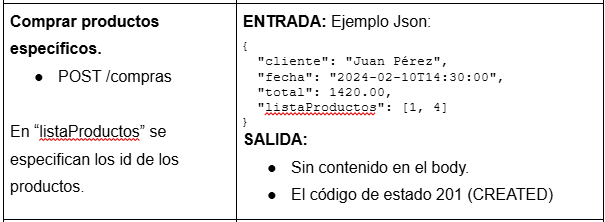

# API Rest de Compras

Debes crear UNA APLICACIÓN CONSISTENTE EN UN SERVICIO REST PARA GESTIONAR COMPRAS.

Estas son las funcionalidades que debes implementar:
- Listar todas las compras realizadas.
- Crear una compra con productos específicos.
- Consultar compras realizadas en un día concreto.

---

## Modelo de datos

Se proporciona los siguientes fuentes que no debes modificar:

- Los entities del modelo.
- El recurso data.sql para para tener datos iniciales.

---

## Base de datos

Debes trabajar con una base de datos H2 en memoria.

Realiza las configuraciones oportunas en tu proyecto.

---

## Estructura básica del proyecto

### Controller

CompraController: 
- RestController que NO usará directamente el repositorio JPA.
- Usará el servicio CompraService.
- Implementa los enpoints pertinentes.

### Entity: Compra y Producto

### Repository: con los repositorios pertinentes.

### Dto
Con los dto pertinentes, si procede...

### Service: CompraService
Servicio que proporcionará las funcionalidades para:
- Devolver la lista de todas las compras.
- Devolver la lista de compras realizadas en un día específico.
- Comprar.

---

## Especificaciones de los endpoints del proyecto

--- 

## AÑADIR CAPA DE SEGURIDAD

Inventa reglas de seguridad a los diferentes endpoits.

